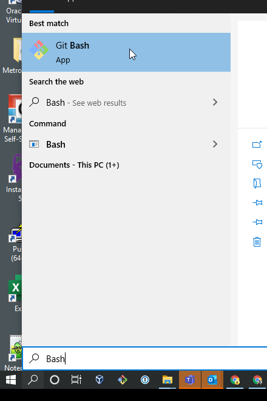
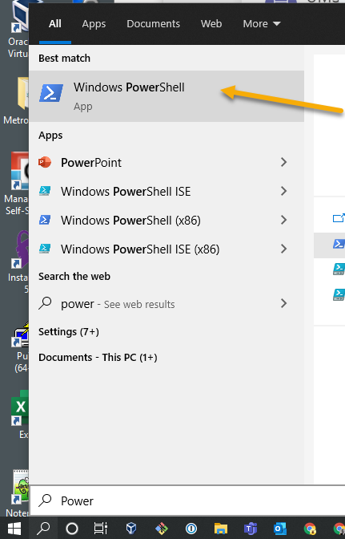
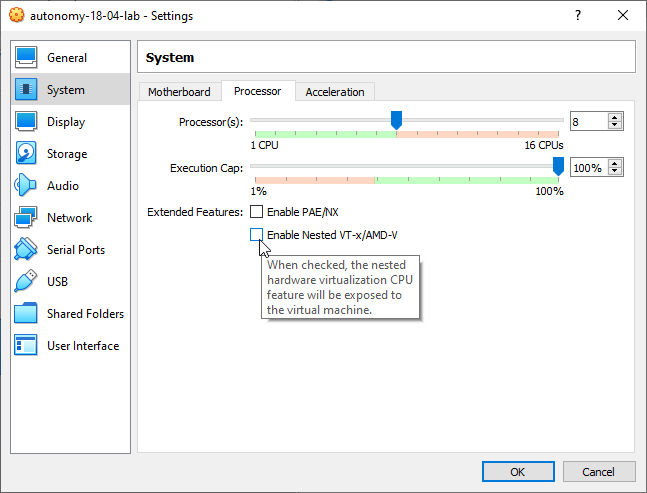
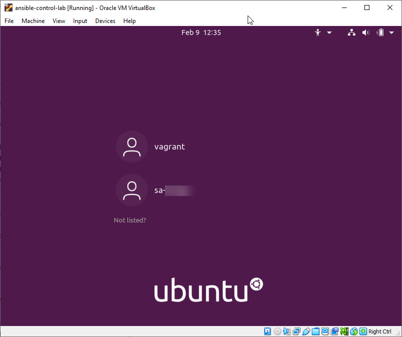
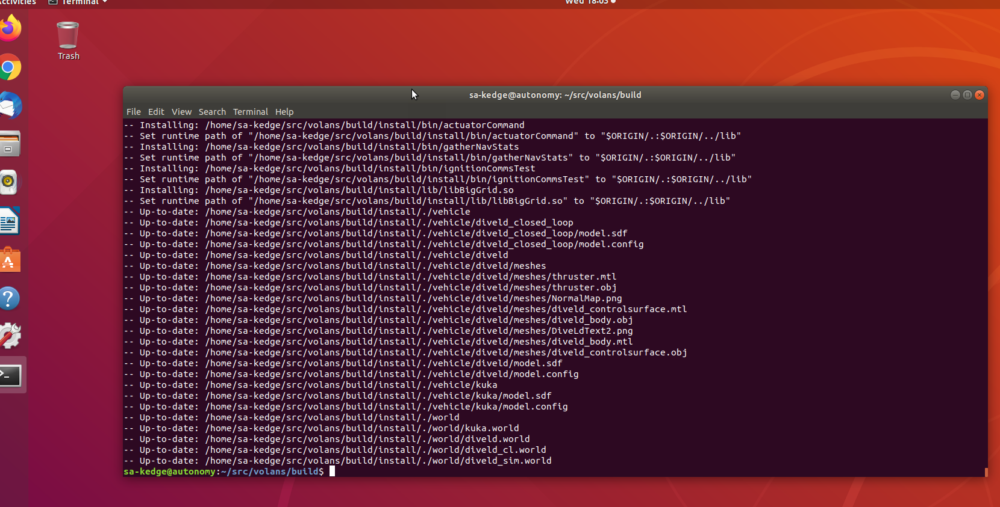

# ansible-d5env-roles

This Ansible role can be used to provision a VirtualBox VM or can be run on a Linux host directly.

### Running on a VirtualBox VM from a Windows 10 host

#### Basics
* [Prepare Windows 10](docs/PrepareWindows10.md)\
    *The following steps expect all the programs described on that page are installed.*
* Download Autonomy Control Vagrant Box [vagrant-autonomy-release-ubuntu1804.box from OneDrive](https://metroninc-my.sharepoint.us/:u:/g/personal/kedge_metsci_com/ERHa7IsveThFg7Op-DGt-fABzjMSqenGaoIZsr65n0_6aA?e=yrgOwc) to your `~/Downloads` folder.\
  *This is a very large file and will take a while to download.  Start download and continue on
with subsequent steps.*
* Generate SSH keys\
  Follow [these directions](https://d5dev.metsci.com/help/ssh/README#generate-an-ssh-key-pair)
  focusing on '*Git Bash on Windows*' for OS-specific steps.\
  **IMPORTANT**: Do NOT follow any Windows Subsystem for Linux (WSL) steps!.
  > The instructions to add a *passphrase* is a personal choice, it is the opinion of this
  > author that the added safety of a ssh *passphrase* doesn't compensate for having to
  > manually add your ssh key to an ssh-agent so the passphrase entry is automatic in the end.
  > If you feel the same, skip that step. Otherwise, you are going to have to login to add your
  > passphrased-ssh key to the ssh-agent after an initial attempt to clone repos fails.
 

### Vagrant, Ansible, VMs ... Oh My!
* Clone this `ansible-autonomy-role` project to a your Windows 10 host
  * Open GitBash for Windows (*leave open for subsequent steps*)\
    
  * Clone into the directory that you put all you development projects
    ```
    bazowk㉿D7RS-WSKB-MCM MINGW64
    $ mkdir Projects; cd Projects
    bazowk㉿D7RS-WSKB-MCM MINGW64
    $ git clone git@d5dev.metsci.com:kedge/ansible-autonomy-role.git
    ```
* Create [Ansible Vault](https://docs.ansible.com/ansible/latest/user_guide/vault.html) of Confidential User Information\
  This step will create an encrypted file containing a user's id/password to
  create a user in ubuntu and access Metron network SMB shares. It will also
  contain a copy of the user's private SSH key used to access our gitlab repo.\
  **WARNING:** you have to have completed the checks to ensure you have
  execution permissions to execute PowerShell scripts in [Prepare Windows 10](docs/PrepareWindows10.md)
  or PowerShell may prevent you from running `./secrets.ps1`.
  * Open PowerShell (regular non-admin):\
  
  * Enter:
    ```
    PS C:\Windows\system32> cd ~\Projects\ansible-autonomy-role
    PS C:\Users\userid\Projects\ansible-autonomy-role> .\secrets.ps1
    ```
    *Answer prompts. Should look something like this in the end:*
    ```
    PS C:\Users\userid\Projects\ansible-autonomy-role> .\secrets.ps1
    Directory: C:\Users\userid\Projects\ansible-autonomy-role\.
    Mode                 LastWriteTime         Length Name
    ----                 -------------         ------ ----
    -a----         7/28/2021   5:30 PM              0 secrets.yml
    Enter your Metron userid: bazowk
    Enter your Metron password: ****************
    Enter location of git private ssh key file [Enter to skip]: C:\Users\bazowk\.ssh\gitlab_rsa
    Enter the secrets password: ********
    
        Directory: C:\Users\bazowk\.ssh
    Mode                 LastWriteTime         Length Name
    ----                 -------------         ------ ----
    -a----         7/28/2021   5:31 PM              0 secrets_pwd.txt
    ```

* Once the Vagrant box has finished downloading from [vagrant-autonomy-release-ubuntu1804.box from OneDrive](https://metroninc-my.sharepoint.us/:u:/g/personal/kedge_metsci_com/ERHa7IsveThFg7Op-DGt-fABzjMSqenGaoIZsr65n0_6aA?e=yrgOwc)
  (started above), enter the following into your open GitBash for Windows install it into Vagrant's
  local box registry (Vagrant registry location: `~/.vagrant.d/boxes`).:
    ```
    bazowk㉿D7RS-WSKB-MCM MINGW64
    $ vagrant box add --name vagrant-autonomy-dev-18-04 "file:///C:/Users/<userid>/Downloads/vagrant-autonomy-release-ubuntu1804.box" 
    ```
  *That will take a wee bit to finish.\
   Once finished, you can save space on you HD by deleting `~/Downloads/vagrant-ansible-control-20.04.box`*

  * Start Provision (use any shell you prefer: cmd, PS, or Git Bash for Windows)
      ```
      PS C:\Users\userid\Projects\ansible-autonomy-role> vagrant up 
      Bringing machine 'default' up with 'virtualbox' provider...
      ==> default: Importing base box 'vagrant-ansible-control-20.04'...
      ==> default: Matching MAC address for NAT networking...
      ==> default: Setting the name of the VM: ansible-autonomy-role
      ==> default: Clearing any previously set network interfaces...
      ==> default: Preparing network interfaces based on configuration...
      default: Adapter 1: nat
      default: Adapter 2: hostonly
      ==> default: Forwarding ports...
      default: 22 (guest) => 2222 (host) (adapter 1)
      ==> default: Running 'pre-boot' VM customizations...
      ==> default: Booting VM... 
      ...
      ```
    *A series of Ansible `TASK`'s will run ~20mins culminating with a report:
    (See **Help:** below if you have problems):*
      ```
      ...
      PLAY RECAP *********************************************************************
      default                    : ok=55   changed=5    unreachable=0    failed=0    skipped=33   rescued=0    ignored=0
    
      ==> default: Running provisioner: shell...
          default: Running: inline script
      ==> default: Running provisioner: shell...
          default: Running: inline script
          default: VM IP: 10.0.2.15/24 192.168.9.142/22
      PS C:\Users\userid\Projects\ansible-autonomy-role>
      ```
      **HELP:**
      * If you see the `VERR_INTERNAL_ERROR` error very early on:
        ```shell
        ==> default: Running 'pre-boot' VM customizations...
        ==> default: Booting VM...
        There was an error while executing `VBoxManage`, a CLI used by Vagrant
        for controlling VirtualBox. The command and stderr is shown below.
      
        Command: ["startvm", "c05fe3d8-2a7b-4c5c-bfed-0c0c02cba1a5", "--type", "gui"]
      
        Stderr: VBoxManage.exe: error: Nonexistent host networking interface, name '' (VERR_INTERNAL_ERROR)
        VBoxManage.exe: error: Details: code E_FAIL (0x80004005), component ConsoleWrap, interface IConsole
        ```
        ... open the VirtualBox Manager and check the Network Settings for the `autonomy-18-04` VM
        to be sure the first NIC is set to NAT.  Don't be surprised if is indeed already set; 
        click [Apply] anyway.\
        \
        Retry '`vagrant up`' on the commandline.\
        \
        This issue is due to [this open Vagrant bug](https://github.com/hashicorp/vagrant/issues/10294).  Follow instructions above; no need to follow
        suggested work-arounds in that ticket.\
    
      * If you see the `VERR_CPUM_INVALID_HWVIRT_CONFIG` error very early on:
      ```shell
      ==> default: Running 'pre-boot' VM customizations...
      ==> default: Booting VM...
      There was an error while executing `VBoxManage`, a CLI used by Vagrant
      for controlling VirtualBox. The command and stderr is shown below.
    
      Command: ["startvm", "big hash number", "--type", "gui"]
    
      Stderr: VBoxManage.exe: error: Cannot enable nested VT-x/AMD-V without nested-paging and unresricted guest execution!
      VBoxManage.exe: error:  (VERR_CPUM_INVALID_HWVIRT_CONFIG)
      VBoxManage.exe: error: Details: code E_FAIL (0x80004005), component ConsoleWrap, interface IConsole
      ```
      ... open the VirtualBox Manager, open Settings fro `autonomy-18-04` VM and navigate to
      `System > Processor` and make sure `Enable Nested VT-x/AMD-V` is deselected.
      
    Click [OK].\
    Retry `vagrant up` on the commandline.

    * If `vagrant provision` cannot connect to the `vagrant` SMB share to install files:
      ```shell
      TASK [Mount SMB network share that has all the vargrant installables] **********
      fatal: [default]: FAILED! => {"changed": false, "msg": "Error mounting /mnt/vagrant: mount error(5): Input/output error\nRefer to the mount.cifs(8) manual page (e.g. man mount.cifs) and kernel log messages (dmesg)\n"}
      ```

      ... then ssh into the running VM and check to see if you can manually mount the share (use Windows `your_user_id`, not `sa-your_user_id`):
      ```shell
      % vagrant ssh
      $ sudo mkdir /mnt/vagrant
      $ sudo mount --type cifs -o "username=your_user_id" //cifs_svr.metsci.com/cetus-div5/Projects/Periscope/vagrant /mnt/vagrant
      Password for your_user_id@//cifs_svr.metsci.com/cetus-div5/Projects/Periscope/vagrant:
      $ ls /mnt/vagrant/
      ```
      ... ls should show the mounted content if you have access and bridged network access. Unmount mount point and try `vagrant provision` again:
      ```shell
      $ sudo umount /mnt/vagrant
      $ exit
      % vagrant provision
      ```


* Log into your new account on the VM's GUI (not the `vagrant` account!)\
  

## Builds from CLI

* Build `Volans`
  * Open a terminal and enter:
    ```
    sa-userid@autonomy:~$ cd ~/src/volans
    sa-userid@autonomy:~/src/volans$ mkdir cmake-build-release && cd cmake-build-release
    sa-userid@autonomy:~/src/volans/cmake-build-release$ cmake -G Ninja -DMET_USE_DDS=ON -DCONNEXTDDS_DIR=/opt/rti -DGRAVEYARD=ON .. && ninja install
    ```
    *There are 300+ files to compile here, so sit back and hope for the following:*\
    

* Build 'Graveyard'
  * In terminal:
     ```
    sa-userid@autonomy:~$ cd ~/src/graveyard
    sa-userid@autonomy:~/src/graveyard$ mkdir cmake-build-release && cd cmake-build-release
    sa-userid@autonomy:~/src/graveyard/cmake-build-release$ cmake -G Ninja .. && ninja install
    ```
