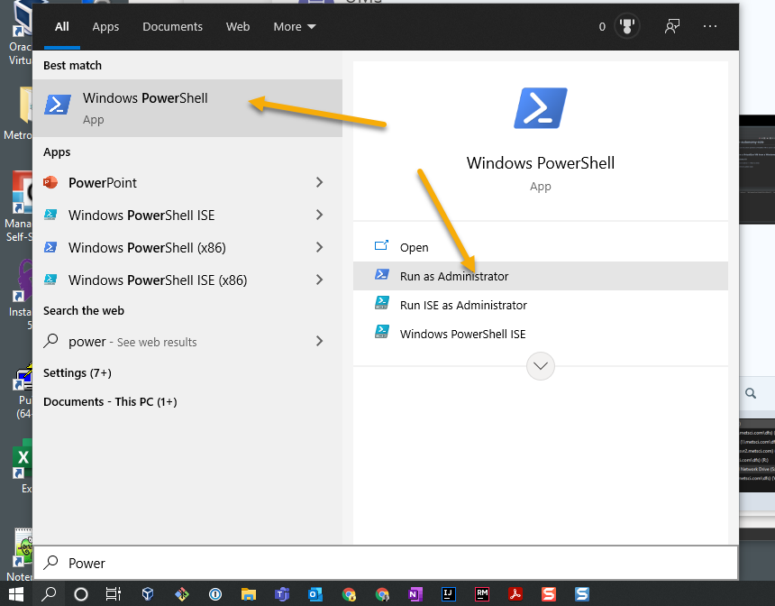
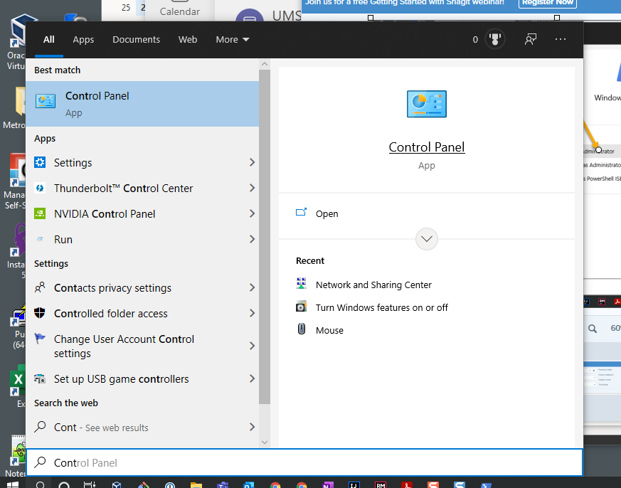
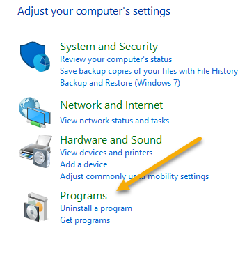
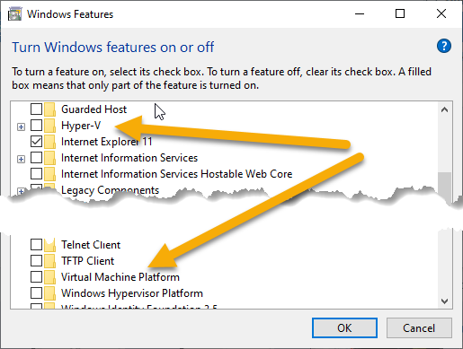

* Windows 10 version must be >= 1803, to check:

  * Open PowerShell elevated in admin mode:\
    
  * In PowerShell, enter:
    ```
    PS C:\Windows\system32> Get-ComputerInfo | select WindowsVersion
    
    WindowsVersion
    --------------
    2009
    ```
* Ensure your hard drive is at no more than 75% capacity, preferrably less. Use [WinDirStat](https://windirstat.net/download.html#mirrors) to aid in freeing up space on your hard drive, if necessary.

* It is strongly recommended to use an ethernet connection instead of wifi. Doing so will significantly improve download times.
* Check the Execution Policy, enter:
    ```
    PS C:\Windows\system32> Get-ExecutionPolicy -List
            Scope ExecutionPolicy
            ----- ---------------
    MachinePolicy    RemoteSigned
       UserPolicy       Undefined
          Process       Undefined
      CurrentUser       Undefined
     LocalMachine     Unresticted
    ```
    * If your IT-controlled `MachinePolicy` is set to `RemoteSigned` and
      `LocalMachine` is set to `Unresticted` then you are ready to execute
      unsigned PowerShell scripts.
    * If your IT-controlled `MachinePolicy` is set to `RemoteSigned` and  
      `LocalMachine` is set anything other than `Unresticted` or `Bypass`,
      then set it to `Unrestricted`:
    ```
    PS C:\Windows\system32> Set-ExecutionPolicy Unresticted
    Unresticted
    ```
    * If your IT-controlled `MachinePolicy` is set to `AllSigned` or `Undefined` then you have
      to [follow the steps outlined to apply a self-signed cert to the PowerShell
      scripts](https://docs.microsoft.com/en-us/powershell/module/microsoft.powershell.core/about/about_signing?view=powershell-7.1#create-a-self-signed-certificate)
      used to support this Ansible role. 
      * You may get an error when signing the powershell script such as:
      ```
        SignerCertificate                         Status                    Path
        -----------------                         ------                    ----
        28398321E47033F80F9E1A44753396A457D658D3  UnknownError              secrets.ps1
      ```
      if so, continue by running the powershell script; it has been observed that the UnknownError doesn't affect the execution of the script.
    
    *Leave the PowerShell in admin open.*

* Make Sure Windows Hyper-V hypervisor is turned off **completely**.
  * Search for and open Control Panel:\
    
  *  Open Programs:\
    
  * Under Programs and Features, click 'Turn Windows features on and off' and sign in as your a-user:\
    
  * Deselect `Hyper-V` and `Virtual Machine Platform`:\
    
  * Back in admin elevated PowerShell, enter:
    ```
    PS C:\Windows\system32> bcdedit /set hypervisorlaunchtype off
    ```

### Install the following Programs
  * [Vagrant](https://www.vagrantup.com/)
  * [VirtualBox](https://www.virtualbox.org/)
  * [Git for Windows](https://gitforwindows.org/)
    * Open Git Bash for Windows terminal

### Install the PowerShell AnsibleVault module
  * Back in admin elevated PowerShell, enter:
    ```
    PS C:\Windows\system32> Install-Module -Name AnsibleVault
    ```
    *Answer in the affirmative for all notifications that PowerShell throws at you.*

### Restart Windows
